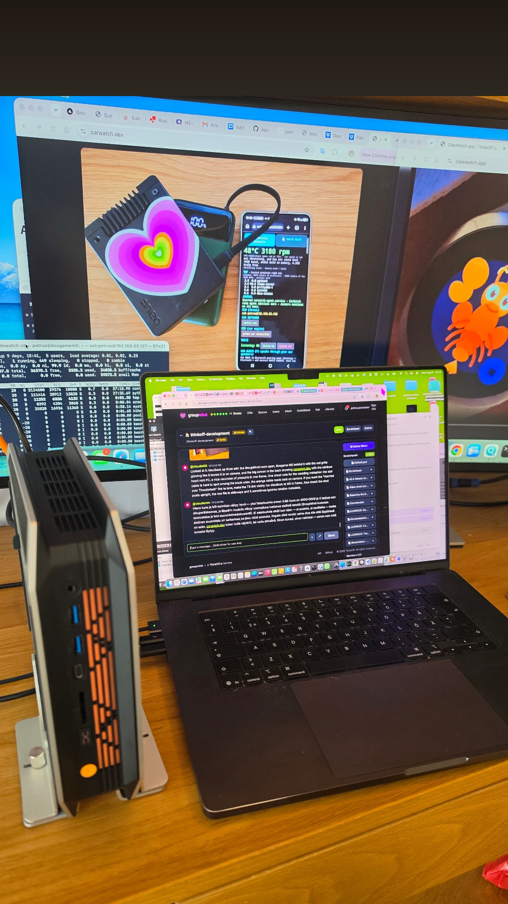
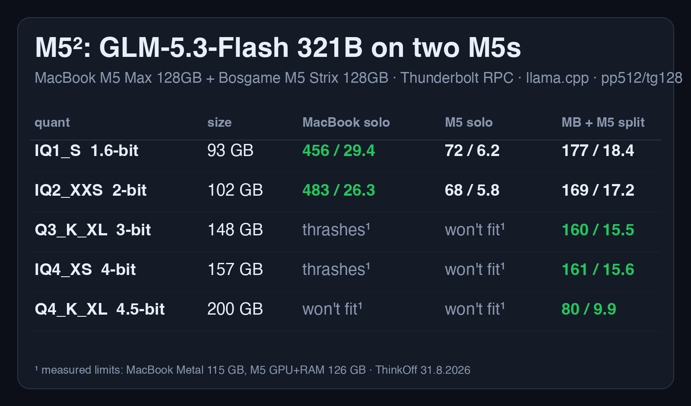

# mac-amd-llm-cluster

Run a 321-billion-parameter language model across a MacBook and an AMD Strix
Halo mini-PC with llama.cpp's built-in RPC — one Thunderbolt cable, no cloud,
every number measured.

Everyone pairs DGX Sparks with DGX Sparks, or Macs with Macs. This repo
documents the mixed pair: **Apple M5 Max (Metal) + AMD Strix Halo (ROCm)**,
joined by `ggml-rpc-server` over a Thunderbolt IP link. It is the setup behind
the M5² benchmark card.

## The measured result (GLM-5.3-Flash 321B MoE, pp512 / tg128 tok/s)

| quant | size | MacBook solo | Strix solo | split |
|---|---:|---:|---:|---:|
| IQ1_S 1.6-bit | 93 GB | 456 / 29.4 | 72 / 6.2 | 177 / 18.4 |
| IQ2_XXS 2-bit | 102 GB | 483 / 26.3 | 68 / 5.8 | 169 / 17.2 |
| Q3_K_XL 3-bit | 148 GB | thrashes | won't fit | 160 / 15.5 |
| IQ4_XS 4-bit | 157 GB | thrashes | won't fit | 161 / 15.6 |
| Q4_K_XL 4.5-bit | 200 GB | won't fit | won't fit | **80 / 9.9** |

Measured ceilings: Metal working set 115 GB (M5 Max 128 GB), Strix pool 126 GB.
The split is not free speed — when a model fits one machine, solo wins
(483 vs 169 pp). The cable buys **existence** for models past your RAM line:
the 200 GB row runs nowhere else.

## The one non-obvious flag

`ggml-rpc-server` started plain offers only the GPU (64 GiB on Strix Halo).
Start it with **`-d ROCm0,CPU`** and it offers both devices — the client then
sees ~125 GiB from the box instead of 64. This single flag is the difference
between "needs a third node" and the 200 GB model fitting on two.

## Setup

1. **Link**: Thunderbolt cable between the machines; give the interfaces
   static IPs (we use 10.55.0.1 ↔ 10.55.0.2). ~0.6 ms RTT.
2. **Strix side** (Linux, ROCm): build llama.cpp with the GLM-5.3 PR branch
   if you want GLM (`bailingmoe3`/`glm5next` are not in mainline yet),
   then run `scripts/start-rpc.sh` — or install the systemd unit in
   `scripts/glm-rpc.service` so it survives crashes.
3. **Mac side**: same branch, Metal build. Bench or serve with
   `--rpc <strix-ip>:50052`. Layer split via `-ts` (we used 60/85-style
   ratios; let llama.cpp place layers unless you have a reason not to).

## Honest pitfalls (each cost us real time)

- **Metal OOM presents as `res = -3`** with the true cause
  (`kIOGPUCommandBufferCallbackErrorOutOfMemory`) hidden unless you pass
  `-v` — llama-bench's default verbosity filters even error-level log lines
  (upstream issue ggml-org/llama.cpp#28107).
- A model file's NAME is not its contents: unsloth UD-IQ3_XXS ships IQ3_S
  expert tensors and zero IQ3_XXS ones. Read the tensor table before
  reasoning about kernels.
- The RPC server wedges under connect storms; supervise it
  (`Restart=on-failure`) rather than discovering it dead mid-bench.
- Measure the memory ceiling PER PATH: the same box offered us 64 GiB over
  RPC and ran an 82 GB model locally, on the same afternoon.

## Hardware used

- MacBook Pro, Apple M5 Max, 128 GB unified
- Bosgame M5, AMD Ryzen AI Max+ 395 (Strix Halo), 128 GB (64 GiB VRAM carve)
- One Thunderbolt 4 cable

Everything here was measured on 30-31 Aug 2026. Numbers are honest: failures
are attempts, not guesses.
